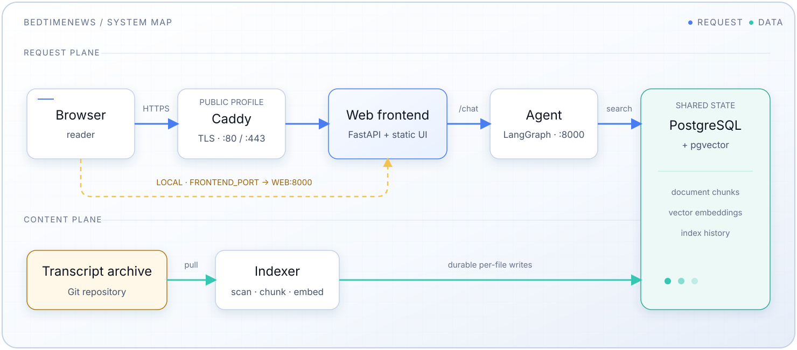

# BedtimeNews Agent

[中文](README.md) | [English](README.en.md) | [Español](README.es-ES.md)

Agentic RAG (Retrieval-Augmented Generation) system for the 睡前消息
(BedtimeNews) knowledge base. Provides Q&A with automatic routing, semantic
search, retrieved-transcript context, and episode citations.

## Overview

This system indexes video transcripts from the [BedtimeNews archive](https://archive.bedtime.news/) and enables semantic search with LLM-powered Q&A. Built with LangGraph, pluggable LLM/embedding providers (DeepSeek for chat and SiliconFlow's Qwen3 embeddings by default), and PostgreSQL + pgvector.

**Key Features:**

- Automatic query routing (archive retrieval vs constrained direct handling)
- Query optimization and semantic search
- LLM-based document grading
- Retrieved transcripts supplied as answer context, with markdown citations and
  citation repair
- Automated document indexing with incremental updates
- Web-based chat interface

## Content Coverage

The system indexes video transcripts from [bedtimenews-archive-contents](https://github.com/bedtimenews/bedtimenews-archive-contents) covering diverse topics across multiple programs:

**Program Catalog:**

| Catalog       | Name       | Description                                     |
| ------------- | ---------- | ----------------------------------------------- |
| `main/`       | 睡前消息   | Comprehensive coverage across all topics        |
| `reference/`  | 参考信息   | Daily news aggregation                          |
| `business/`   | 产经破壁机 | Economy, industry, business, technology         |
| `commercial/` | 讲点黑话   | International relations, geopolitics            |
| `opinion/`    | 高见       | Technical analysis, infrastructure, engineering |
| `daily/`      | 每日新闻   | Daily news updates                              |
| `others/`     | 其它文稿   | Live Q&A and other related content              |

**Topic Categories:**

1. **Domestic Economy & Industry** - Economic policy, industrial development, real estate, local government debt, urban development
2. **Technology & Innovation** - AI, chips, semiconductors, autonomous vehicles, aerospace, engineering
3. **Cross-border E-commerce & Global Expansion** - SHEIN, TikTok, Chinese manufacturing advantages, global markets
4. **Corporate Governance & Regulation** - Corporate scandals, auditing, financial supervision, food safety, tax regulation
5. **International Relations & Geopolitics** - US-China relations, Russia-Ukraine conflict, Middle East, Korean Peninsula, Indo-Pacific
6. **Social Issues & Civil Life** - Education, healthcare, demographics, social welfare, urban governance
7. **Cryptocurrency & Fintech** - Bitcoin, blockchain, decentralized finance, digital assets
8. **Population & Social Policy** - Population crisis, socialized childcare, education system, social welfare reform
9. **Infrastructure & Engineering** - Railway construction, energy infrastructure, urban development, public utilities
10. **Law & Judicial Affairs** - Corporate disputes, criminal justice, consumer protection, regulatory frameworks

## Architecture



**Components:**

- **[Frontend](frontend/README.md)**: Custom chat UI (static HTML/CSS/JS served by a small FastAPI app)
- **[Agent](agent/README.md)**: LangGraph-based agentic RAG service
- **[Indexer](indexer/README.md)**: Automated document embedding pipeline
- **Database**: PostgreSQL with pgvector extension as vector database

The stack serves plain HTTP on port 8080 — no TLS. Public exposure and TLS
termination are handled outside this repo.

## Quick Start

### Prerequisites

- Docker
- API keys for your chosen providers (by default: `DEEPSEEK_API_KEY` for chat and `SILICONFLOW_API_KEY` for embeddings)

### Setup

1. **Clone the repository**

   ```bash
   git clone https://github.com/zydo/bedtimenews-agent.git
   cd bedtimenews-agent
   ```

2. **Configure environment**

   Copy [`.env.example`](.env.example) to `.env` and configure:

   ```bash
   cp .env.example .env
   # Edit .env 
   ```

   > **API keys are read from the shell environment, not from `.env`.** `.env`
   > holds non-secret config (provider/model selection, ports, DB settings);
   > export your secrets in the shell instead, e.g.:
   >
   > ```bash
   > export DEEPSEEK_API_KEY=...      # chat provider
   > export SILICONFLOW_API_KEY=...   # embedding provider
   > ```

3. **Start services**

   ```bash
   docker compose up -d
   ```

4. **Access the UI**

   Open `http://localhost:8080` (plain HTTP; change the host port with
   `FRONTEND_PORT` in `.env`).

   This runs the published images. If you have edited the code, add `--build` —
   see [Published image vs. your checkout](#published-image-vs-your-checkout).

### Verify Installation

```bash
# Check service status
docker compose ps

# View logs
docker compose logs -f
```

### Tests and Coverage

The root test command runs agent, indexer, and frontend in isolated processes:

```bash
uv run pytest
uv run pytest --cov
```

Options are forwarded to every component. To run only one component, invoke it
from that directory:

```bash
cd agent  # or indexer / frontend
uv run pytest --cov
```

## Releases

Tagged releases publish prebuilt multi-arch (amd64 + arm64) images to GHCR via
[`release.yml`](.github/workflows/release.yml):

- `ghcr.io/zydo/bedtimenews-agent-agent`
- `ghcr.io/zydo/bedtimenews-agent-indexer`
- `ghcr.io/zydo/bedtimenews-agent-frontend`

To deploy a published release, pin a version with `IMAGE_TAG` in `.env` (default
`latest`) and pull:

```bash
IMAGE_TAG=0.1.0   # in .env, or leave as latest
docker compose pull
docker compose up -d
```

### Published image vs. your checkout

`docker compose up` **never builds on its own**, even from a source checkout with
local edits. The `image:` key decides what runs:

| Situation                            | What `docker compose up` does           |
| ------------------------------------ | --------------------------------------- |
| Tagged image already present locally | Reuses it — no pull, no build           |
| Tagged image not present locally     | **Pulls** the published image from GHCR |
| `docker compose up --build`          | Builds from the checkout                |

So after editing code, rebuild explicitly or you will keep running the old image:

```bash
docker compose up -d --build agent web
```

Note that a locally built image and a published release share the same tag, so
whichever was created last wins. `docker compose pull` overwrites a local build,
and `--build` overwrites a pulled release.

To cut a release, push a `v*` tag (image tags drop the leading `v`):

```bash
git tag v0.1.0 && git push origin v0.1.0
```

> Release notes should call out operational changes: new/renamed env vars,
> schema changes (e.g. `EMBEDDING_DIM` — see the runbook in
> [indexer/README.md](indexer/README.md)), and whether re-indexing is required.
> `storage/postgres/init.sh` only runs on a fresh data volume, so schema changes
> never apply automatically to existing deployments.

## Service-Specific Documentation

- **[Frontend](frontend/README.md)**: UI customization
- **[Agent](agent/README.md)**: API endpoints, Agentic RAG implementation
- **[Indexer](indexer/README.md)**: Document processing

## Data Persistence

Data is persisted across restarts:

- **PostgreSQL data** (chunks + embeddings): bind-mounted to `./storage/postgres/volume`
- **Service logs**: Docker named volumes `bedtimenews_indexer_logs` and `bedtimenews_agent_logs`

## Project Structure

```plaintext
bedtimenews-agent/
├── agent/              # LangGraph agentic RAG service
│   ├── src/
│   ├── Dockerfile
│   └── README.md
├── frontend/           # Custom web UI (static + FastAPI)
│   ├── server.py       # FastAPI: serves static UI + proxies /chat SSE
│   ├── starters.py     # Sample questions data
│   ├── static/         # index.html, styles.css, app.js, logo
│   ├── Dockerfile
│   └── README.md
├── indexer/            # Document embedding pipeline
│   ├── src/
│   ├── Dockerfile
│   └── README.md
├── docs/diagrams/      # SVG architecture and workflow diagrams
├── storage/            # Database initialization scripts
│   └── postgres/
├── docker-compose.yml  # Service orchestration
├── .env                # Environment configuration (not in git)
├── .env.example        # Environment configuration template
├── THIRD_PARTY_NOTICES.md  # Third-party component licenses
├── README.md           # Project README (中文, default)
├── README.en.md        # English README (this file)
└── README.es-ES.md     # Spanish README
```

## License

MIT License — see [LICENSE](LICENSE) file.

This project bundles third-party components under their own licenses — see
[THIRD_PARTY_NOTICES.md](THIRD_PARTY_NOTICES.md) for details.
