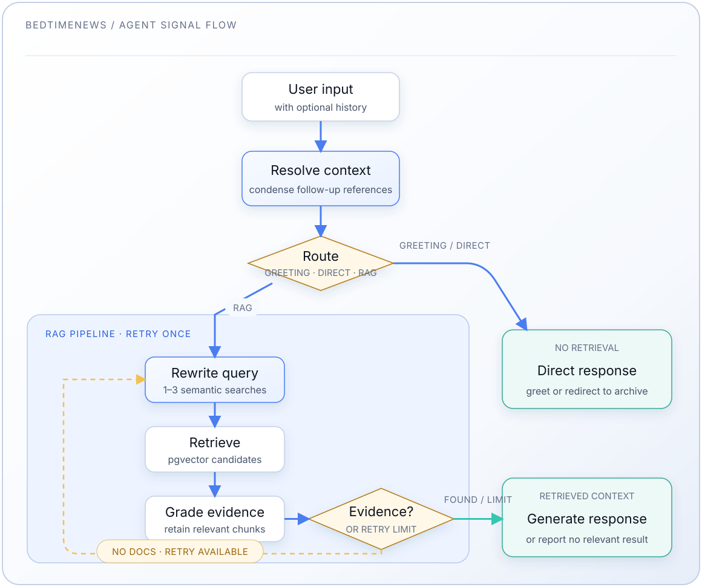

# Servicio Agente

[中文](README.md) | [English](README.en.md) | [Español](README.es-ES.md)

Servicio RAG agente que implementa enrutamiento, optimización de consultas,
recuperación semántica, generación de respuestas condicionada por documentos
y citas de episodios.

Consulta el [README principal](../README.es-ES.md) para las instrucciones de
configuración.

## Arquitectura

### Flujo de Trabajo RAG Agente



**Componentes:**

- `agent.py`: API pública (`agent_query()`, `agent_stream_query()`)
- `graph.py`: Flujo de trabajo LangGraph con enrutamiento inteligente
- `retriever.py`: Búsqueda semántica (embeddings + pgvector)
- `cache.py`: Caché LRU para resultados de consultas
- `chat.py`: Manejadores de endpoints FastAPI
- `main.py`: Servidor FastAPI
- `vector_db.py`: Operaciones de PostgreSQL + pgvector

### Comportamiento de Enrutamiento

El enrutador clasifica la entrada del usuario en tres categorías, que alimentan
dos rutas de ejecución:

**Ruta Directa - Saludo** (sin recuperación):

- Saludos simples: "hi", "hello", "你好"
- Meta-preguntas: "quién eres", "qué puedes hacer"

**Ruta Directa - Fuera de Alcance** (sin recuperación):

- Conocimiento general: "1+1等于几", "法国首都是哪里"
- Temas no relacionados: "今天天气怎么样", "怎么煮面"
- Datos en tiempo real: clima, precios de acciones, actualidad
- El asistente no responde estas desde el conocimiento del modelo; en su lugar
  explica brevemente que quedan fuera del archivo de transcripciones y
  redirige a los temas del archivo

**Ruta RAG** (recuperación aumentada):

- Preguntas relacionadas con BedtimeNews (por defecto)
- Asuntos internos de China, política, economía
- Relaciones internacionales, geopolítica, conflictos
- Tecnología, ciencia, IA, infraestructura
- Problemas sociales, educación, salud, demografía

Antes de enrutar, un paso de condensación resuelve las referencias de las
preguntas de seguimiento contra hasta ocho turnos de historial proporcionados
por el cliente. Una consulta RAG sin documentos relevantes se reescribe y se
reintenta una vez antes de que el generador devuelva una respuesta sin
resultados.

### Límites de Fundamentación (Grounding)

- El prompt de generación indica al modelo respaldar las afirmaciones
  factuales con los documentos recuperados para el turno actual. La
  conversación anterior es contexto de referencia, no evidencia.
- La ruta sin recuperación indica al modelo rechazar respuestas factuales
  fuera del archivo.
- El post-procesamiento de citas repara enlaces de episodios conocidos y
  añade una lista de fuentes si el modelo no emite ninguna cita.
- Esta es una fundamentación basada en prompts y citas, no una verificación
  por afirmación. El servicio no comprueba si cada afirmación generada está
  implicada por su cita. El indicador `grounded` de la API significa que se
  proporcionaron documentos relevantes a la generación; no es una puntuación
  de implicación.

## Referencia de API

### POST /chat

**Solicitud:**

```json
{
  "question": "独山县的债务问题有多严重？",
  "history": [],
  "stream": false
}
```

**Parámetros:**

- `question` (obligatorio): Consulta del usuario
- `history` (opcional, por defecto: `[]`): Hasta ocho turnos previos de
  `{question, answer, grounded}`
- `stream` (opcional, por defecto: false): Habilita el streaming SSE

**Respuesta (sin streaming):**

```json
{
  "answer": "根据[[睡前消息588]](https://archive.bedtime.news/main/501-600/588.md)...",
  "followups": ["独山县后来如何化解债务？"],
  "grounded": true
}
```

**Respuesta (streaming):**

```plaintext
data: {"type": "step", "step": "route", "content": "..."}
data: {"type": "citations", "urls": {"睡前消息588": "https://archive.bedtime.news/main/501-600/588.md"}}
data: {"type": "answer_chunk", "content": "根据"}
data: {"type": "answer_chunk", "content": "睡前"}
data: {"type": "answer_meta", "grounded": true}
data: {"type": "followups", "items": ["独山县后来如何化解债务？"]}
...
data: [DONE]
```

El flujo también puede contener `answer_final` cuando el post-procesamiento
modificó la respuesta transmitida, `error` en caso de fallo, y comentarios de
latido `: ping` durante las etapas silenciosas del pipeline.

## Evaluación

Estos son arneses de evaluación manuales (acceden a una base de datos/LLM
real), no pruebas unitarias automatizadas. Para las pruebas unitarias consulta
el directorio `tests/` de este componente (ejecuta con `cd agent && uv run
pytest`).

### Evaluar el Agente (Flujo RAG Agente Completo)

```bash
# Probar una sola consulta personalizada
docker compose exec agent python -m src.eval_agent -q "独山县的债务问题"
docker compose exec agent python -m src.eval_agent --query "王文银的创业故事有哪些可疑之处"

# Listar categorías de consultas
docker compose exec agent python -m src.eval_agent --list-categories

# Probar una categoría específica
docker compose exec agent python -m src.eval_agent --category education

# Muestra aleatoria
docker compose exec agent python -m src.eval_agent --random 10

# Limitar a las primeras N consultas
docker compose exec agent python -m src.eval_agent --limit 3
```

### Evaluar el Recuperador (Solo Recuperación)

```bash
# Puntúa el conjunto fijo de 20 consultas etiquetadas. Se ejecuta contra la API
# de embeddings y la base de datos en vivo, luego añade recall@k y los rangos
# por consulta al historial rastreado agent/eval_results/retriever.json en el
# host.
docker compose run --rm --build \
  --volume ./agent/eval_results:/app/eval_results \
  agent python -m src.eval_retriever --labelled

# Opcionalmente identifica una ejecución en el historial.
docker compose run --rm --build \
  --volume ./agent/eval_results:/app/eval_results \
  agent python -m src.eval_retriever --labelled --run-label grader-change

# Probar una sola consulta personalizada
docker compose exec agent python -m src.eval_retriever -q "独山县"
docker compose exec agent python -m src.eval_retriever --query "你的问题"

# Probar la recuperación con parámetros personalizados
docker compose exec agent python -m src.eval_retriever \
  --category education \
  --match-count 10 \
  --threshold 0.3

# Muestra aleatoria
docker compose exec agent python -m src.eval_retriever --random 20
```

## Configuración

### Selección de Modelos

El chat y los embeddings se configuran de forma independiente mediante
`LLM_PROVIDER` y `EMBEDDING_PROVIDER`. Los nombres de los modelos se leen de
variables de entorno con prefijo de proveedor, así que las claves dependen de
los proveedores que elijas. Con los valores por defecto
(`LLM_PROVIDER=deepseek`, `EMBEDDING_PROVIDER=siliconflow`), configura en
`.env`:

```bash
# Modelo rápido (enrutamiento, reescritura de consultas, calificación)
DEEPSEEK_FAST_MODEL=deepseek-v4-flash

# Modelo de generación (respuesta final)
DEEPSEEK_GENERATION_MODEL=deepseek-v4-flash

# Modelo de embeddings
SILICONFLOW_EMBEDDING_MODEL=Qwen/Qwen3-Embedding-4B
```

**Notas:**

- Para usar OpenAI en su lugar, establece `LLM_PROVIDER=openai` /
  `EMBEDDING_PROVIDER=openai` y proporciona `OPENAI_FAST_MODEL`,
  `OPENAI_GENERATION_MODEL`, `OPENAI_EMBEDDING_MODEL` (más `OPENAI_API_KEY`).
- **Las dimensiones de los embeddings deben coincidir con la columna de la
  base de datos.** La columna `embedding halfvec(N)` se dimensiona desde
  `EMBEDDING_DIM` (`.env`, por defecto `2560` para
  `Qwen/Qwen3-Embedding-4B`). Cambiar a un modelo con una dimensión diferente
  requiere un cambio de esquema y una re-incrustación completa — consulta el
  manual "Cambiar el Modelo de Embedding" en `indexer/README.es-ES.md`.

**Ajustes de Recuperación:**

- `match_count`: Por defecto 30 (`RETRIEVAL_MATCH_COUNT`), aumenta para mejor
  recall
- `match_threshold`: Por defecto 0.4 (`MATCH_THRESHOLD`), aumenta para mayor
  precisión (pero menos resultados)
- `top_k`: Por defecto 15 (`RETRIEVAL_TOP_K`), máximo de chunks únicos
  enviados a calificación
- El reintento de refinamiento de consultas está fijado actualmente a un solo
  reintento en `create_initial_state()`; no se configura mediante una variable
  de entorno

## Desarrollo

### Estructura del Proyecto

```plaintext
agent/src/
├── main.py            # Servidor FastAPI
├── chat.py            # Manejadores de endpoints
├── agent.py           # API RAG agente
├── graph.py           # Flujo de trabajo LangGraph
├── retriever.py       # Búsqueda semántica con caché
├── cache.py           # Implementación de caché LRU
├── vector_db.py       # Operaciones de base de datos
├── models.py          # Modelos Pydantic
├── settings.py        # Configuración
├── eval_agent.py      # Arnés de evaluación manual del pipeline
├── eval_retriever.py  # Arnés de evaluación manual de recuperación
└── eval_queries.py    # Categorías y ejemplos de consultas de evaluación
```

### Acceso de Red

El servicio agente se ejecuta **solo en la red interna de Docker** (no
expuesto al host):

```bash
# Acceso desde el host (vía docker exec)
docker compose exec agent curl http://localhost:8000/chat \
  -H "Content-Type: application/json" \
  -d '{"question": "test"}'

# Acceso desde otro contenedor (vía nombre de servicio)
curl http://agent:8000/chat \
  -H "Content-Type: application/json" \
  -d '{"question": "test"}'
```

El frontend web es el único servicio publicado al host — HTTP puro en el
puerto 8080, sin TLS (la exposición pública y la terminación TLS se gestionan
fuera de este repositorio). Proxies `/chat` al agente a través de la red
interna de Docker; el agente mismo nunca se expone al host.

### Depuración

```bash
# Ver logs
docker compose logs -f agent

# Acceder al contenedor
docker compose exec agent sh

# Probar la conexión a la base de datos (el helper vive en el servicio indexer)
docker compose exec indexer python -m src.debugger test

# Probar una sola consulta
docker compose exec agent python -m src.eval_agent --limit 1
```

## Mapeo de Tipos de Episodio (desde la ruta doc_id)

- `main/*` → "睡前消息"
- `reference/*` → "参考信息"
- `opinion/*` → "高见"
- `daily/*/*` → "每日新闻"
- `commercial/*` → "讲点黑话"
- `business/*` → "产经破壁机"
- `livestream/*/*` → "直播问答记录"
