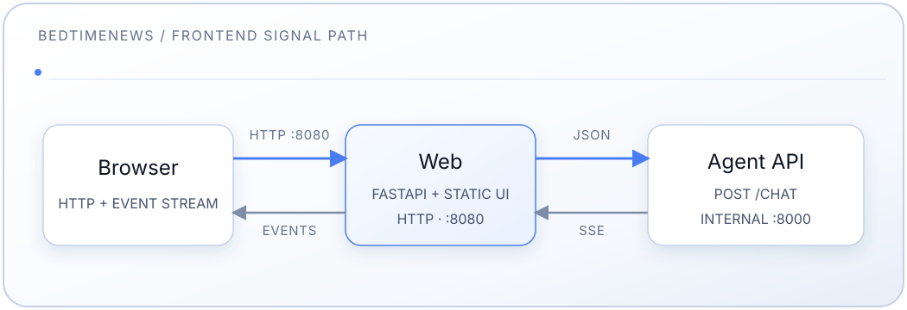

# Frontend Service

[中文](README.md) | [English](README.en.md) | [Español](README.es-ES.md)

Custom chat UI for the BedtimeNews Agentic RAG system. A static single-page app
(HTML/CSS/JS) served by a small FastAPI app that also proxies the chat stream to
the internal agent backend.

See the [main README](../README.en.md) for full-stack setup.

## Design

- **Theme:** colors are derived from the show logo — a deep navy-black base, a
  royal-blue primary accent, and a golden-yellow accent for live/in-progress
  signals. Light and dark themes follow the live OS `prefers-color-scheme` by
  default. The masthead toggle creates a persistent `localStorage` override.
- **Color tokens** are semantic and themeable (`--bg`, `--surface`, `--line`,
  `--text`, `--text-dim`, `--muted`, `--accent`, `--accent-2`), defined for dark
  in `:root` and overridden under `[data-theme="light"]`.
- **Type:** system CJK stack (PingFang SC / Microsoft YaHei / Noto Sans SC) for
  reading and a monospace stack for labels/data. Fonts are system-only by design
  — no webfont CDN, so the page loads reliably from mainland China.
- **Signal-acquisition log:** applicable RAG pipeline stages
  (condense → route → rewrite → retrieve → grade → generate) render as a live
  log that locks once the answer starts, then collapses. Condense appears only
  when conversation history resolves a follow-up.

## Features

- Anonymous chat (no authentication)
- System-aware light/dark theme with a persistent manual toggle
- Sample questions grouped by category (full question is the clickable text)
- Real-time SSE streaming with visible pipeline steps
- Markdown answers rendered with [markdown-it](https://github.com/markdown-it/markdown-it)
  (vendored locally; `html:false` for XSS safety) plus app-specific citation chips
- Ephemeral, in-page conversation (cleared on refresh)
- Responsive to mobile; keyboard-accessible; respects `prefers-reduced-motion`

## Architecture



The frontend:

- Runs in a Docker container that serves plain HTTP on port 8080 (no TLS —
  public exposure and TLS termination are handled outside this repo)
- Is the only service published to the host (`FRONTEND_PORT`, default 8080)
- Proxies `/chat` to the agent over the internal Docker network; the agent is
  never exposed to the host

## Components

- **server.py** — FastAPI app: serves `static/`, exposes `/api/starters`, and
  proxies `/chat` SSE to the agent
- **starters.py** — sample-question data (categories + questions); plain data,
  no UI-framework dependency
- **static/index.html** — page markup, theme-boot script, and turn templates
- **static/styles.css** — themeable design system (`:root` + `[data-theme="light"]`)
- **static/app.js** — sample-question list, composer, theme toggle, SSE parsing,
  Markdown rendering
- **static/markdown-it.min.js** — vendored Markdown renderer (MIT), fetched on
  demand rather than at page load
- **static/bedtimenews.webp** — favicon / brand logo
- **pyproject.toml** — dependency metadata (`fastapi`, `uvicorn`, `httpx`)

## Endpoints

| Method | Path            | Purpose                                     |
| ------ | --------------- | ------------------------------------------- |
| GET    | `/`             | Serves the SPA (`static/index.html`)        |
| GET    | `/api/starters` | Sample questions JSON (`categories`)        |
| POST   | `/chat`         | Proxies the agent SSE stream to the browser |
| GET    | `/healthz`      | Liveness check                              |

## Development Workflow

The container runs `uvicorn server:app`. After changing Python or static files,
rebuild and restart:

```bash
# The frontend is published on the host (FRONTEND_PORT, default 8080)
docker compose build web
docker compose up -d web
open http://localhost:8080
```

> Use `--no-cache` if a rebuild appears to serve stale code.

### Run without Docker

```bash
cd frontend
pip install .
# Point at a reachable agent backend:
AGENT_BACKEND_HOST=localhost AGENT_BACKEND_PORT=8000 \
  uvicorn server:app --reload --port 8080
```

### Customization

- **Starter questions / categories:** edit `starters.py` (`CATEGORIES`).
- **Styling:** edit `static/styles.css` (design tokens live in `:root`).
- **Copy / layout:** edit `static/index.html`.
- **Logo / favicon:** replace `static/bedtimenews.webp`. It renders at 2.1rem, so
  keep it small — 128px square is enough for hi-DPI, and the file is cached for a
  week by `CachedStaticFiles`.

## Configuration

| Variable             | Default | Purpose                                     |
| -------------------- | ------- | ------------------------------------------- |
| `AGENT_BACKEND_HOST` | `agent` | Agent service name on the Docker network    |
| `AGENT_BACKEND_PORT` | `8000`  | Agent port                                  |
| `FRONTEND_PORT`      | `8080`  | Host port the frontend is published on      |

## Debugging

```bash
# Logs
docker compose logs -f web

# Backend connectivity from inside the container (the slim image has no
# ping/curl; use the bundled Python + httpx instead)
docker compose exec web python -c "import httpx; print(httpx.post(
    'http://agent:8000/chat', json={'question': '测试'}, timeout=120).text)"
```

## API Contract

The frontend proxies the agent's `/chat` endpoint.

### Request

```json
{
  "question": "string (required)",
  "history": [{"question": "…", "answer": "…", "grounded": true}],
  "stream": true
}
```

`history` is optional; the browser sends at most its three most recent turns.

### Streaming response (SSE)

```json
{"type": "step", "step": "condense|route|rewrite|retrieve|grade|generate", "content": "…"}
{"type": "citations", "urls": {"episode name": "https://archive.bedtime.news/…"}}
{"type": "answer_chunk", "content": "…"}
{"type": "answer_final", "content": "…", "grounded": true}
{"type": "answer_meta", "grounded": true}
{"type": "followups", "items": ["…"]}
{"type": "error", "content": "…"}
```

The server may emit `: ping` SSE comments between events and terminates every
stream with `data: [DONE]`. A successful turn sends exactly one of
`answer_final` or `answer_meta`.

## Limitations (MVP)

- **No authentication** — anonymous only
- **No persistence** — conversation is cleared on refresh
- **Per-tab session** — no cross-tab or server-side history

## Troubleshooting

**Port 8080 in use:** set `FRONTEND_PORT` in `.env` to another host port and
recreate the service (`docker compose up -d web`).

**Cannot connect to backend:**

- `docker compose ps agent` and `docker compose logs agent`
- Connectivity check from inside the container (see [Debugging](#debugging))

**Changes not appearing:** rebuild (`--no-cache`) and hard-refresh the browser
(Cmd/Ctrl+Shift+R).
