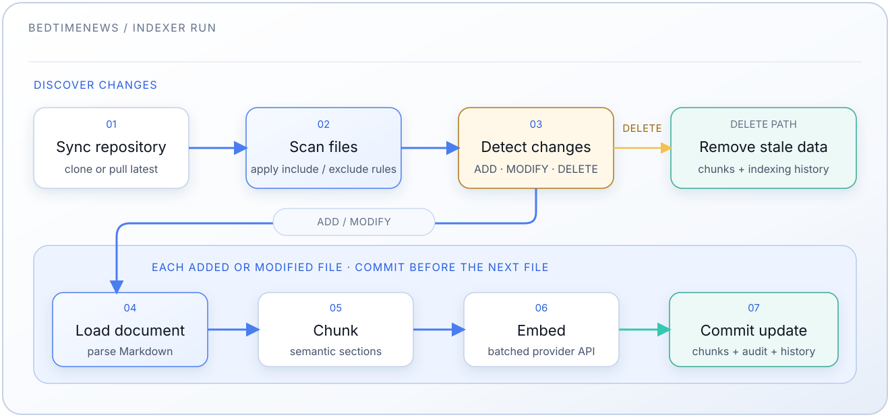

# Servicio Indexador

[中文](README.md) | [English](README.en.md) | [Español](README.es-ES.md)

Pipeline automatizado de incrustación de documentos para el archivo de
BedtimeNews. Clona el repositorio, procesa archivos markdown, genera embeddings
y los almacena en PostgreSQL + pgvector.

Consulta el [README principal](../README.es-ES.md) para las instrucciones de
configuración.

## Características

- **Sincronización automática**: Clona/actualiza desde
  [bedtimenews-archive-contents](https://github.com/bedtimenews/bedtimenews-archive-contents)
- **Procesamiento incremental**: Detección de cambios basada en contenido
  (SHA256)
- **Ejecución programada**: Planificador en proceso con una expresión cron
  configurable (por defecto: cada hora)
- **Fragmentación inteligente**: Fragmentación semántica consciente de Markdown
- **Embeddings por lotes**: Uso eficiente de la API de embeddings por lotes
- **Monitoreo**: Depurador y estadísticas integrados

## Fases del Pipeline



Los archivos añadidos y modificados se cargan, fragmentan, incrustan y
confirman un archivo a la vez. Esto mantiene duraderos los archivos completados
si un archivo posterior falla. Las eliminaciones quitan tanto los chunks
almacenados como el historial de detección de cambios.

## Configuración

### Programación Cron

Establece en `.env`:

```bash
# Cada hora (por defecto)
INDEXER_CRON_SCHEDULE="0 * * * *"

# Cada 30 minutos
INDEXER_CRON_SCHEDULE="*/30 * * * *"

# Diario a las 2 AM
INDEXER_CRON_SCHEDULE="0 2 * * *"
```

### Filtros de Documentos

Edita `index_config.yml`:

```yaml
# Patrones de inclusión (procesados primero)
include:
  # 睡前消息
  - "main/*/*.md"

  # 参考信息
  - "reference/*/[0-9]*.md"

  # 高见
  - "opinion/[0-9]*.md"

  # 每日新闻 (YYYY/MM/DD.md)
  - "daily/*/*/[0-9]*.md"

  # 讲点黑话
  - "commercial/[0-9]*.md"

  # 产经破壁机
  - "business/[0-9]*.md"
  - "business/-[0-9]*.md" # -1.md and -2.md

  # 直播问答记录
  - "livestream/*/*/[0-9]*.md"

# Patrones de exclusión (procesados tras la inclusión)
exclude:
  # Archivos índice de directorio
  - "main/[0-9]*-[0-9]*.md"
  - "reference/[0-9]*-[0-9]*.md"
  - "livestream/[0-9]*.md"
  - "daily/[0-9]*.md"


# Reglas de validación de archivos
validation:
  # Tamaño mínimo de archivo en bytes (omite archivos vacíos o diminutos)
  min_file_size: 100

  # Tamaño máximo de archivo en bytes (omite archivos extremadamente grandes)
  max_file_size: 10485760 # 10 MB
```

## Utilidades de Depuración

### Probar Conexión

```bash
docker compose exec indexer python -m src.debugger test
```

### Ver Estadísticas

```bash
# Estadísticas de la base de datos
docker compose exec indexer python -m src.debugger stats

# Acciones de archivos recientes
docker compose exec indexer python -m src.debugger recent --limit 20

# Historial de indexación de todos los archivos
docker compose exec indexer python -m src.debugger history

# Historial de un archivo específico
docker compose exec indexer python -m src.debugger history main/901-1000/960.md
```

### Inspeccionar Documentos

```bash
# Ver los chunks de un documento
docker compose exec indexer python -m src.debugger inspect main/901-1000/960.md
```

### Ver Logs

```bash
# Logs de la ejecución programada más reciente
docker compose exec indexer python -m src.debugger logs

# Últimas 100 líneas
docker compose exec indexer python -m src.debugger logs --lines 100

# Todos los logs
docker compose exec indexer python -m src.debugger logs --all
```

### Ejecución Manual

```bash
# Ejecutar el pipeline manualmente (una vez)
docker compose exec indexer python -m src.pipeline
```

### Borrar Datos

```bash
# PELIGRO: Borrar todos los datos indexados
docker compose exec indexer python -m src.debugger clear
```

## Esquema de Base de Datos

El indexador gestiona tres tablas en el esquema `rag`:

**`rag.document_chunks`**: Almacena chunks con embeddings

- `chunk_id`: Identificador único (`{doc_id}:{chunk_index}`)
- `doc_id`: Ruta del documento sin extensión
- `chunk_index`: Índice basado en 0 dentro del documento
- `heading`: Encabezado de sección (si existe)
- `text`: Contenido del chunk
- `word_count`: Número de palabras
- `embedding`: Vector `halfvec(N)` — `N` proviene de `EMBEDDING_DIM`
  (`.env`), aplicado por `storage/postgres/init.sh` en la primera
  inicialización de la BD, y **debe igualar la dimensión de salida del modelo
  de embeddings** (por defecto `2560` para `Qwen/Qwen3-Embedding-4B`). Consulta
  [Cambiar el Modelo de Embedding](#cambiar-el-modelo-de-embedding). El
  **tipo** de columna está fijado intencionalmente a `halfvec` (no
  configurable): cabe cualquier modelo de hasta 4000 dimensiones — incluidos
  los modelos de menor dimensión de OpenAI — con la mitad del almacenamiento y
  una pérdida de recall despreciable, y los casts de inserción/consulta en
  `{agent,indexer}/src/vector_db.py` también usan `::halfvec`. Cambia el tipo
  solo para precisión float32 completa, >4000 dimensiones, o embeddings
  binarios/dispersos (también requiere cambiar la opclass del índice y esos
  casts).
- `created_at`: Marca de tiempo

**`rag.indexing_history`**: Rastrea el estado de los archivos

- `file_path`: Ruta relativa en el repositorio
- `content_hash`: Hash SHA256 para detección de cambios
- `indexed_at`: Cuándo se procesó el archivo
- `last_modified`: Tiempo de modificación del archivo

**`rag.file_actions`**: Registro de auditoría

- `file_path`: Ruta relativa
- `action_type`: ADD, MODIFY o DELETE
- `content_hash`: Hash SHA256 (NULL para DELETE)
- `run_timestamp`: Cuándo se registró la acción
- `processed_at`: Cuándo se procesó la acción

## Cambiar el Modelo de Embedding

Cambiar `EMBEDDING_PROVIDER` / `*_EMBEDDING_MODEL` en `.env` **no** es un
reemplazo directo. Debes re-incrustar todo el corpus, porque:

- Los vectores de modelos diferentes **no son comparables**, incluso con la
  misma dimensión — así que un cambio de modelo siempre requiere
  re-incrustación.
- Cada modelo emite una **dimensión fija** (p.ej. `Qwen/Qwen3-Embedding-4B` =
  2560, `text-embedding-3-small` = 1536, `text-embedding-3-large` = 3072,
  `text-embedding-004` = 768). La columna `embedding halfvec(N)` se dimensiona
  desde `EMBEDDING_DIM` (`.env`) mediante `storage/postgres/init.sh`. Si la
  dimensión del nuevo modelo difiere, **el tipo de columna en sí debe
  cambiar**, o las inserciones fallan con `expected N dimensions, not M`.
- `init.sh` se ejecuta **solo cuando Postgres inicializa un volumen de datos
  vacío**, y usa `CREATE TABLE IF NOT EXISTS`. Cambiar `EMBEDDING_DIM`
  después **no** altera una base de datos existente.

### Manual de Procedimiento

```bash
# 1. Detener servicios
docker compose down

# 2. Editar .env: establece el nuevo EMBEDDING_PROVIDER / *_EMBEDDING_MODEL (y clave API).

# 3. Busca la dimensión de salida del nuevo modelo (docs del proveedor), llámala N.

# 4. Establece EMBEDDING_DIM=N en .env (init.sh dimensiona la columna desde ello en una init fresca).
```

Luego aplica la dimensión a la base de datos — elige una:

**Opción A — recrear el volumen (lo más simple; borra la BD para que `init.sh`
se vuelva a ejecutar):**

Los datos de Postgres viven en un **bind mount**
(`./storage/postgres/volume`), así que `docker compose down -v` NO lo limpia —
debes eliminar el contenido del directorio tú mismo. Muévelo a un lado
(reversible) en lugar de borrarlo directamente:

```bash
docker compose down
mv storage/postgres/volume storage/postgres/volume.bak   # punto de reversión reversible
docker compose up -d postgres   # init.sh se ejecuta fresco, dimensionando la columna desde EMBEDDING_DIM
# La BD está ahora vacía, así que la detección de cambios trata cada archivo
# como nuevo (paso 6 opcional).
# Una vez verificada la re-incrustación, elimina la copia: rm -rf storage/postgres/volume.bak
```

**Opción B — alterar la tabla existente in situ (conserva las demás tablas):**

```bash
docker compose up -d postgres
docker compose exec postgres psql -U "$POSTGRES_USER" -d "$POSTGRES_DB" -c "
  DROP INDEX IF EXISTS rag.idx_embedding_hnsw;
  TRUNCATE rag.document_chunks;
  ALTER TABLE rag.document_chunks ALTER COLUMN embedding TYPE halfvec(N);
  CREATE INDEX idx_embedding_hnsw ON rag.document_chunks
    USING hnsw (embedding halfvec_cosine_ops);
"
```

Termina re-incrustando:

```bash
# 6. Restablece el estado de detección de cambios para que el indexador
#    re-incruste todo.
#    OBLIGATORIO tras la Opción B (indexing_history aún guarda hashes antiguos,
#    o el indexador verá "sin cambios" y saltará). Inofensivo tras la Opción A.
docker compose up -d indexer
docker compose exec indexer python -m src.debugger clear --force

# 7. Re-incrustar el corpus completo
docker compose exec indexer python -m src.pipeline

# 8. Verificar dimensión + número de filas
docker compose exec postgres psql -U "$POSTGRES_USER" -d "$POSTGRES_DB" \
  -c "\d rag.document_chunks" | grep embedding
docker compose exec indexer python -m src.debugger stats
```

> `debugger clear` trunca `document_chunks`, `indexing_history` y
> `file_actions`, y elimina el clon local de contenido (se vuelve a clonar en
> la siguiente ejecución).

## Copia de Seguridad y Restauración de Datos

El volumen de datos de PostgreSQL se almacena en un directorio gitignored del
código. Puedes respaldar y restaurar toda la base de datos con archivos tar
estándar.

### Respaldo de Datos PostgreSQL

**Requisitos previos**: Detén todos los servicios para garantizar la
consistencia de los datos:

```bash
docker compose down
```

**(Opcional) Comprobar el tamaño del volumen (sin comprimir)**:

```bash
du -h -d 0 storage/postgres/volume
```

**Crear copia de seguridad**:

```bash
# Crear archivo de respaldo con marca de tiempo
tar czf /path/to/backup/postgres-volume-$(date +%F).tar.gz storage/postgres/volume/

# Salida de ejemplo: /path/to/backup/postgres-volume-2025-11-27.tar.gz
```

La copia de seguridad incluye:

- Todos los chunks de documentos indexados y embeddings
- Historial de indexación y acciones de archivos
- Configuración y metadatos de la base de datos

### Restaurar Datos PostgreSQL

**Requisitos previos**: Detén todos los servicios:

```bash
docker compose down
```

**Restaurar desde la copia de seguridad**:

```bash
# Eliminar datos existentes (si los hay)
rm -rf storage/postgres/volume

# Extraer la copia al directorio de datos de postgres (ejecuta en la raíz del proyecto)
tar xzf /path/to/backup/postgres-volume-2025-11-27.tar.gz -C .
# Verifica que los archivos se extrajeron como ./storage/postgres/volume/18/docker/...

# Iniciar servicios
docker compose up -d
```

**Verificar la restauración**:

```bash
# Comprobar estadísticas de la base de datos
docker compose exec indexer python -m src.debugger stats

# Ver acciones de archivos recientes
docker compose exec indexer python -m src.debugger recent --limit 10
```

### Notas

- **Solo local**: El directorio de datos de postgres está en `.gitignore` y no
  se rastrea por control de versiones
- **Migración**: Las copias de seguridad son portables y pueden restaurarse en
  diferentes máquinas
- **Espacio en disco**: Cada copia suele oscilar entre 100MB y varios GB según
  el contenido indexado

## Estructura del Proyecto

```plaintext
indexer/src/
├── entrypoint.py        # Punto de entrada principal
├── pipeline.py          # Orquestación del pipeline de indexación
├── scheduler.py         # Planificador cron
├── git_sync.py          # Sincronización de repositorio
├── file_scanner.py      # Escaneo del sistema de archivos
├── document_loader.py   # Procesamiento de Markdown
├── change_detector.py   # Comparación de hash de contenido
├── chunker.py           # Fragmentación semántica
├── embeddings.py        # Generación de embeddings (abstracción de proveedor)
├── vector_db.py         # Operaciones de base de datos
├── debugger.py          # Utilidades de depuración
├── stats.py             # Cálculo de estadísticas
├── models.py            # Modelos de datos
├── paths.py             # Gestión de rutas
└── settings.py          # Configuración
```

## Monitoreo

### Comprobar Estado del Servicio

```bash
# Ver logs
docker compose logs -f indexer

# Comprobar el proceso del planificador sin privilegios
docker compose top indexer

# Verificar que la base de datos tiene documentos
docker compose exec indexer python -m src.debugger stats
```

### Salida Esperada

Tras la primera ejecución deberías ver:

- Repositorio clonado en `indexer/data/bedtimenews-archive-contents/`
- Chunks en `rag.document_chunks`
- Acciones de archivos registradas en `rag.file_actions`

### Métricas de Rendimiento

El pipeline muestra tras cada ejecución:

- Total de documentos procesados
- Total de chunks creados
- Total de tokens procesados
- Promedio de tokens por chunk
- Llamadas estimadas a la API de embeddings

## Solución de Problemas

**No se indexó ningún documento:**

```bash
# Comprobar errores en los logs
docker compose logs indexer | grep -i error

# Ejecutar el pipeline manualmente
docker compose exec indexer python -m src.pipeline

# Verificar que el git clone tuvo éxito
docker compose exec indexer ls -la data/bedtimenews-archive-contents/
```

**Errores de la API de embeddings:**

- Comprueba la clave API del proveedor de embeddings (p.ej.
  `SILICONFLOW_API_KEY`) en tu entorno
- Verifica que no se excedan los límites de velocidad
- Consulta el uso de la API en el panel del proveedor
- `expected N dimensions, not M`: la dimensión de salida del modelo no
  coincide con la columna `embedding halfvec(N)` (dimensionada desde
  `EMBEDDING_DIM`) — consulta
  [Cambiar el Modelo de Embedding](#cambiar-el-modelo-de-embedding)

**Conexión a la base de datos fallida:**

- Asegúrate de que postgres esté en ejecución: `docker compose ps postgres`
- Comprueba las credenciales en `.env`
- Prueba la conexión: `docker compose exec indexer python -m src.debugger test`

**El planificador no se ejecuta:**

```bash
# Comprobar el proceso del planificador
docker compose top indexer

# Ver logs de ejecuciones programadas
docker compose exec indexer python -m src.debugger logs

# Reiniciar el servicio
docker compose restart indexer
```
